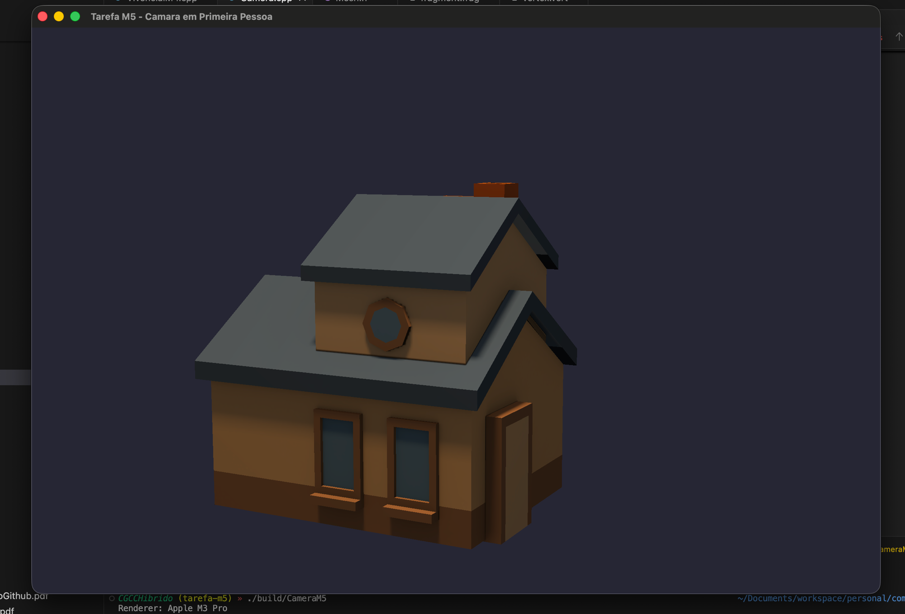

# Tarefa M5 – Câmera em Primeira Pessoa

**Autor:** Leonardo Meinerz Ramos

## Screenshot



## Como executar

```bash
cmake -B build
cmake --build build --target CameraM5
./build/CameraM5
```

## Controles

| Tecla / Ação | Função |
|---|---|
| `W` | Mover para frente |
| `S` | Mover para trás |
| `A` | Mover para a esquerda |
| `D` | Mover para a direita |
| Mouse | Olhar ao redor |
| Scroll (dois dedos) | Zoom (ajusta o FOV) |
| `Esc` | Sair |
